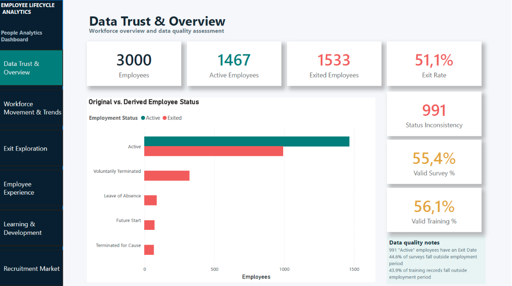
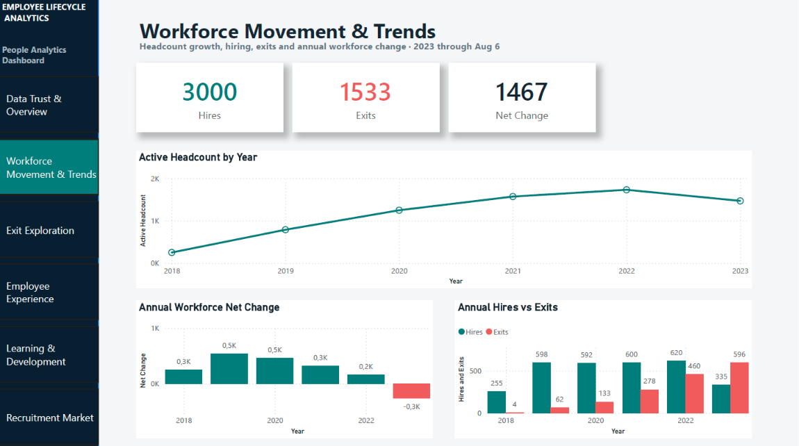
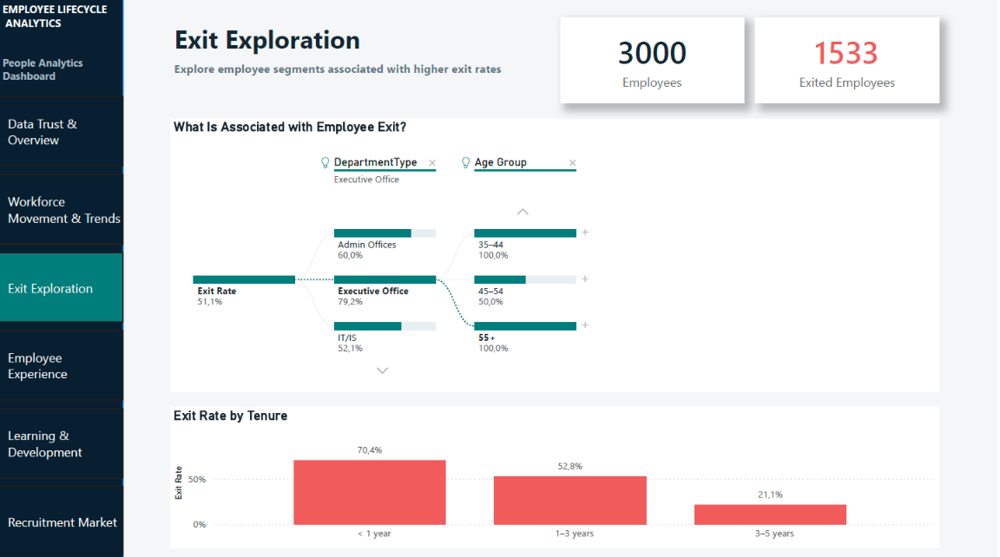
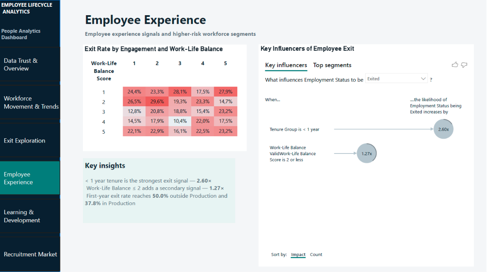
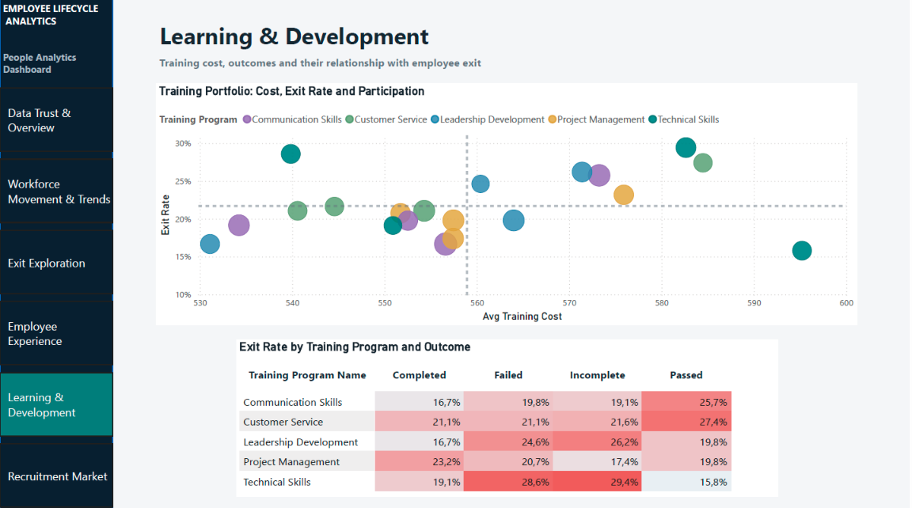
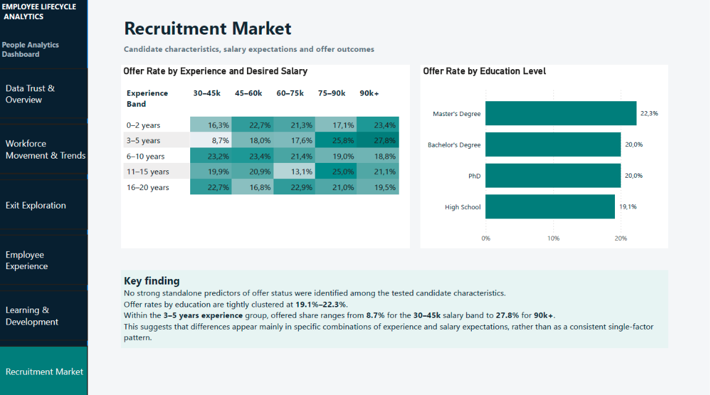

# Employee Lifecycle Analytics

A People Analytics portfolio project built from four HR datasets covering workforce movement, employee experience, learning & development, recruitment, retention, and data quality.

The main question was not only *who leaves*, but also whether the underlying HR data is reliable enough to support that analysis.

## Project summary

The project uses four datasets with 3,000 records each:

- employee_data.csv
- employee_engagement_survey_data.csv
- training_and_development_data.csv
- recruitment_data.csv

The work included SQL-based data quality checks, Power Query cleaning, Power BI data modeling, DAX measures, segmentation, Decomposition Tree, Key Influencers, and dashboard design.

**Tools:** MySQL, DBeaver, Power Query, Power BI, DAX

**Dataset:** [Employee/HR Dataset (All in One) — Kaggle](https://www.kaggle.com/datasets/ravindrasinghrana/employeedataset)

The public repository contains the README, SQL data-quality audit, dashboard screenshots, and an interactive HTML companion. The Power BI source file is not public and is **available upon request for recruitment or technical review**.

The HTML companion was created with AI assistance after the Power BI project was completed. The analysis, metrics, findings, page structure, and visual design come from the original project.

---

## What I wanted to answer

The analysis focuses on six areas:

1. Can the source data be trusted?
2. How did hiring, exits, and active headcount change over time?
3. Which employee segments show higher exit rates?
4. How are engagement, satisfaction, and work-life balance related to exit?
5. Do training outcomes show different retention patterns?
6. Do experience, salary expectations, or education appear related to offer status?

---

## Data quality came first

Before building the dashboard, I audited the raw tables in MySQL.

### Employee data

The employee table contains 3,000 records. The biggest issue was employee status: **991 employees were marked Active while also having an Exit Date**.

For analysis, employment status was therefore derived from ExitDate instead of trusting the original status field.

Other checks found trailing spaces in Title and DepartmentType, while the date fields parsed correctly. A small number of unusual age-at-hire values were kept in the data rather than silently removed.

### Engagement data

There are 3,000 survey records, but only **1,662 surveys (55.4%)** fall inside the employee's actual employment period.

- 287 surveys occurred before the employee's Start Date
- 1,051 occurred after the Exit Date

Those records were retained and flagged, but only valid surveys are used in the Employee Experience analysis.

### Training data

The same validation was applied to training dates.

Out of 3,000 records, **1,683 (56.1%)** are valid.

- 288 training records occurred before hire
- 1,029 occurred after exit

Only valid training records are used in the L&D analysis.

### Recruitment data

The recruitment table could not be reliably linked to employees.

Although the ID ranges overlap, ID + name matching did not establish a trustworthy candidate-to-employee relationship. The table also contains highly granular job titles and inconsistent geography.

Rather than forcing a questionable relationship into the model, I kept recruitment as a separate analytical dataset.

---

## Data preparation and model

Power Query was used to clean and prepare the model while keeping the raw source queries separate.

For employees, I trimmed inconsistent text fields, parsed the dates, and created:

- HasExit
- EmploymentStatus_Clean
- Tenure Years
- Tenure Group
- Age at Hire
- Age Group

EmploymentStatus_Clean was derived from ExitDate: employees without an Exit Date were classified as **Active**, while employees with an Exit Date were classified as **Exited**.

Engagement and training records were classified as Valid, Before Hire, or After Exit by comparing their dates with each employee's employment period.

The employee table is the central workforce table. It has one-to-one relationships with the engagement and training tables. Recruitment remains disconnected because the source does not contain a reliable employee linkage.

A separate DateTable supports both Start Date and Exit Date analysis. Start Date uses the active relationship; Exit Date is handled through the inactive relationship in the relevant measures.

I also separated measures into workforce, engagement, training, recruitment, and data-quality groups to keep the model easier to navigate.

---

# Dashboard

## 1. Data Trust & Overview

The first page makes the data-quality problems visible instead of hiding them during cleaning.

**Headline metrics**

- 3,000 employees
- 1,467 active employees
- 1,533 exited employees
- 51.1% overall exit rate
- 991 source-status inconsistencies
- 55.4% valid surveys
- 56.1% valid training records

The original status field is shown against the derived status so the inconsistency can be seen directly.

---

## 2. Workforce Movement & Trends

This page tracks hiring, exits, net workforce change, and active headcount over time.

The available data runs through **August 6, 2023**, so 2023 is a partial year and should not be compared with prior years as if it were complete.

---

## 3. Exit Exploration

The Decomposition Tree explores exit rate by department, age group, performance score, and tenure.

The clearest broad pattern is tenure:

- **< 1 year: 70.4% exit rate**
- **1–3 years: 52.8%**
- **3–5 years: 21.1%**

This page uses the **full employee population**. Deeper branches are exploratory and can become small, so high percentages are treated as signals to investigate rather than standalone conclusions.

---

## 4. Employee Experience

This page uses only employees with valid survey records.

Key Influencers identifies two main signals:

- **Tenure < 1 year: 2.60×**
- **Work-Life Balance ≤ 2: 1.27×**

Among employees with valid surveys, first-year exit rate reaches:

- **50.0% outside Production**
- **37.8% in Production**
- **42.0% combined**

These numbers are not directly comparable with the 70.4% first-year exit rate on the Exit Exploration page because they use different populations.

The 20.5% baseline on the Employee Experience page represents the exit rate within the valid-survey population (340 of 1,662 employees), not the 51.1% company-wide exit rate. This population is skewed toward retained employees because valid survey timing requires the survey to fall within the employment period: only 22.2% of exited employees have a valid survey, compared with 90.1% of active employees.

The engagement / work-life-balance heatmap does not show a clean linear relationship between engagement and exit. Work-life balance is a clearer secondary signal.

The Top segments view also suggests that the pattern changes with tenure. Early tenure dominates first, but a later-tenure Production segment with **Work-Life Balance ≤ 2** still shows a **27.6% exit rate across 192 employees**, versus the 20.5% valid-survey baseline.

I interpret this as a context-dependent pattern rather than evidence that any one factor causes exit.

---

## 5. Learning & Development

The L&D page compares training cost, participation, program, outcome, and exit rate.

Two examples stand out:

**Technical Skills**

- Passed: 15.8% exit rate
- Incomplete: 29.4%
- Difference: 13.6 percentage points

**Leadership Development**

- Completed: 16.7%
- Incomplete: 26.2%
- Difference: 9.5 percentage points

The direction is not consistent across every program, so the conclusion is not that incomplete training causes exit. The more useful finding is that training outcomes should be interpreted in the context of the specific program.

---

## 6. Recruitment Market

Recruitment is analyzed separately because it cannot be linked reliably to employee records.

Offer rates by education are tightly clustered:

- Master's Degree: 22.3%
- Bachelor's Degree: 20.0%
- PhD: 20.0%
- High School: 19.1%

Within candidates with 3–5 years of experience, offered share ranges from **8.7%** in the 30–45k desired-salary band to **27.8%** in the 90k+ band.

No strong standalone predictor of offer status emerged from the tested candidate characteristics. The larger differences appear in specific combinations rather than in one universal factor.

---

# What I would take to the business

### First-year retention deserves the most attention

The strongest and most consistent signal in the project is early tenure. I would investigate onboarding quality, manager support, expectation alignment, early feedback, probation-period exits, and structured termination reasons.

### Non-Production first-year exits deserve a separate review

Within the valid-survey subset, first-year exit is particularly high outside Production. I would not assume the same explanation applies across the entire workforce.

### Work-life balance is useful in context

Low work-life balance is not a standalone prediction rule. It becomes more informative when combined with tenure and workforce segment.

### L&D should be reviewed at program-and-outcome level

A single completion rate is too broad. Program, outcome, and retention should be looked at together.

### The HR data model needs stronger linking and history

For a production environment, I would want stable employee and candidate IDs, candidate-to-hire mapping, effective-dated status history, standardized recruitment timestamps, structured termination reasons, and consistent temporal validation.

---

# Limitations

- The source contains substantial timing and consistency issues.
- Recruitment cannot be linked reliably to employees.
- Recruitment geography is not suitable for analysis.
- 2023 is a partial year ending August 6.
- Some segments are small and can produce visually high rates.
- Key Influencers and segmentation show associations, not causation.
- Engagement and training analyses use only records validated against the employment period.
- Metrics across dashboard pages do not always use the same population. The 70.4% first-year exit rate uses the full workforce; the Employee Experience metrics use only employees with valid survey records.

---

# Repository contents

- README.md
- data_quality_audit.sql
- Employee_Lifecycle_Interactive_Dashboard.html
- dashboard/ with six Power BI screenshots

The public repository intentionally does not include the Power BI source file.

**Power BI source file (.pbix) is available upon request for recruitment or technical review.**

The raw Kaggle CSV files are also not included; the original dataset is linked above.

---

# Skills demonstrated

People Analytics, HR data quality, SQL, MySQL, DBeaver, Power Query, Power BI, DAX, data modeling, workforce metrics, retention analysis, employee experience analysis, L&D analytics, recruitment analytics, segmentation, Decomposition Tree, Key Influencers, and business interpretation.

---

## Final note

The most useful part of this project was not finding one dramatic number. It was deciding which records could be trusted, which relationships could be modeled, and where the data did **not** support a stronger conclusion.

For me, that is the point of the project: useful People Analytics starts before the dashboard.
